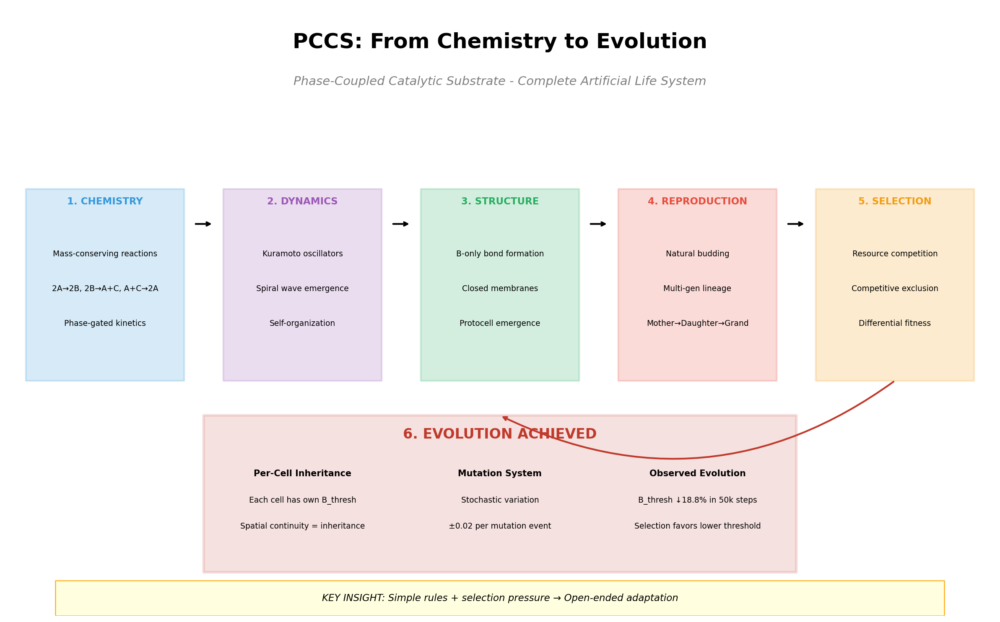

# Phase-Coupled Catalytic Substrate (PCCS)

[](https://www.python.org/downloads/)
[](https://github.com/ml-explore/mlx)
[](https://opensource.org/licenses/MIT)

A novel cellular automaton designed to exhibit emergent life-like complexity through the interplay of **spatial structure** (membranes), **chemical dynamics** (reactions), and **temporal organization** (phase-coupled oscillations).


## The Core Insight

> *Life is not just chemistry—it is **orchestrated** chemistry.*

Real metabolism operates through precisely timed reaction cascades, not random diffusion. PCCS captures this by making temporal phase relationships fundamental to the dynamics, creating conditions where sustained metabolism *requires* the spontaneous emergence of phase-locked compartmentalized structures.

## Features

- **Phase-Gated Reactions**: Chemical reactions only proceed efficiently when the cell's internal oscillator is at the right phase
- **Emergent Spiral Waves**: Phase dynamics naturally produce spiral wave patterns
- **Protocell Formation**: B-concentration-based bonds create closed membrane structures
- **Natural Division**: Protocells reproduce through budding without intervention
- **Multi-Generation Lineages**: Mother → Daughter → Granddaughter demonstrated
- **Selection & Evolution**: Competitive exclusion and parameter adaptation observed
- **Kuramoto Synchronization**: Coupled oscillator dynamics create synchronized domains
- **Apple Silicon Optimized**: Built on MLX for maximum performance on M-series chips

## Installation

### Requirements

- macOS with Apple Silicon (M1/M2/M3/M4)
- Python 3.11 or later

### Quick Start

```bash
# Clone the repository
git clone https://github.com/yourusername/pccs.git
cd pccs

# Create virtual environment
python -m venv .venv
source .venv/bin/activate

# Install with dependencies
pip install -e ".[dev]"

# Run the simulation
python -m pccs.main
```

### Verify GPU Access

```python
import mlx.core as mx
print(f"Default device: {mx.default_device()}")  # Should show 'gpu'
```

## Usage

### Basic Simulation

```python
from pccs import Simulation, Config

# Create simulation with default parameters
config = Config(grid_size=256)
sim = Simulation(config)

# Run for 1000 steps
for _ in range(1000):
    sim.step()
    
# Visualize final state
sim.visualize()
```

### Parameter Exploration

```python
# Adjust parameters for different behaviors
config = Config(
    grid_size=256,
    D_base=0.1,          # Diffusion rate
    alpha=0.9,           # Membrane impermeability
    kappa=2.0,           # Phase gate sharpness
    K_phase=0.5,         # Phase coupling strength
    B_thresh=0.3,        # Bond formation threshold
)
```

### Real-Time Visualization

```bash
# Launch with live visualization
python -m pccs.main --visualize --fps 30

# Save frames for video
python -m pccs.main --save-frames output/
```

## Documentation

- **[Findings & Insights](docs/FINDINGS.md)** - What we learned during development
- **[Product Requirements Document](docs/PRD.md)** - Complete technical specification
- **[Implementation Phases](docs/IMPLEMENTATION_PHASES.md)** - Step-by-step build guide
- **[Testing Strategy](docs/TESTING_STRATEGY.md)** - Verification approaches

## How It Works

### The Three Axes

| Axis | Mechanism | Emergent Structure |
|------|-----------|-------------------|
| **Spatial** | Bonds, diffusion gating | Membranes, compartments |
| **Chemical** | Reactions, catalysis | Metabolism, autocatalysis |
| **Temporal** | Phase oscillations | Synchronized domains |

### The Reaction Cycle

```
2A → 2B           (φ ≈ 0)      Dimerization
2B → A + C        (φ ≈ 2π/3)   Breakdown (releases catalyst)
A + C → 2A        (φ ≈ 4π/3)   Autocatalysis
```

Each reaction is **phase-gated**—it only fires efficiently when the cell's oscillator phase is near the target value. The stoichiometry is mass-conserving: 2 molecules in → 2 molecules out.

### Membrane Formation

Bonds form based on **B concentration only** (not phase alignment):

```
P_bond = sigmoid(θ_B × (B_i + B_j - 2×B_thresh))
```

This creates closed membranes at high-B regions, which follow the resource injection pattern. Key insight: phase-aligned bonds would form *inside* synchronized domains, but B-only bonds form at *boundaries* where B accumulates.

### Emergent Phenomena

With appropriate parameters, the system exhibits:

1. **Spiral Wave Dynamics** - Phase oscillations self-organize into rotating spiral patterns
2. **Phase Synchronization Domains** - Regions of coherent oscillation emerge from Kuramoto coupling
3. **Protocells** - Closed membrane structures surrounding metabolically active regions
4. **Multi-Protocell Coexistence** - Multiple protocells maintain separate boundaries

|  |  |
|:---:|:---:|
| Spiral wave dynamics | Single protocell |

|  |  |
|:---:|:---:|
| Natural budding (mother + daughter) | Three-generation lineage |

|  |  |
|:---:|:---:|
| B_thresh evolution over 50k steps | Complete evolutionary journey |

### Demonstrated Capabilities

PCCS has been experimentally verified to exhibit:

| Capability | Evidence | Experiment |
|------------|----------|------------|
| **Spiral Wave Emergence** | Self-organizing rotating patterns | Phase dynamics |
| **Protocell Formation** | Closed B-based membranes | Center injection |
| **Natural Division (Budding)** | Mother spawns independent daughter | Exp 6 |
| **Multi-Generation Lineages** | Mother → Daughter → Granddaughter | Exp 7 |
| **Competitive Selection** | Winner-take-all under shared resources | Exp 8b |
| **Heritable Fitness Variation** | B_thresh differences = 2.5-3.8x advantage | Exp 9 |
| **Observable Evolution** | 18.8% B_thresh adaptation over 50k steps | Exp 10 |

This represents a complete proof-of-concept for artificial life evolution from first principles:
- Reproduction (budding)
- Inheritance (spatial continuity)
- Variation (mutation)
- Selection (competition)

## Performance

On Apple M4 Max (tested configuration):

| Grid Size | Steps/Second | Memory |
|-----------|--------------|--------|
| 128×128   | ~500         | ~50 MB |
| 256×256   | ~150         | ~200 MB |
| 512×512   | ~40          | ~800 MB |

## Contributing

Contributions are welcome! Please see the [PRD](docs/PRD.md) for design principles and the [Implementation Phases](docs/IMPLEMENTATION_PHASES.md) for areas where help is needed.

## Citation

If you use PCCS in your research, please cite:

```bibtex
@software{pccs2026,
  title = {Phase-Coupled Catalytic Substrate: A Novel Cellular Automaton for Emergent Life-Like Complexity},
  author = {Claude (Anthropic)},
  year = {2026},
  url = {https://github.com/yourusername/pccs}
}
```

## License

MIT License - see [LICENSE](LICENSE) for details.

## Acknowledgments

This design draws inspiration from:
- Lenia and Flow-Lenia (continuous cellular automata)
- Ono-Ikegami protocell models
- Kuramoto coupled oscillator theory
- Autopoiesis (Maturana & Varela)
